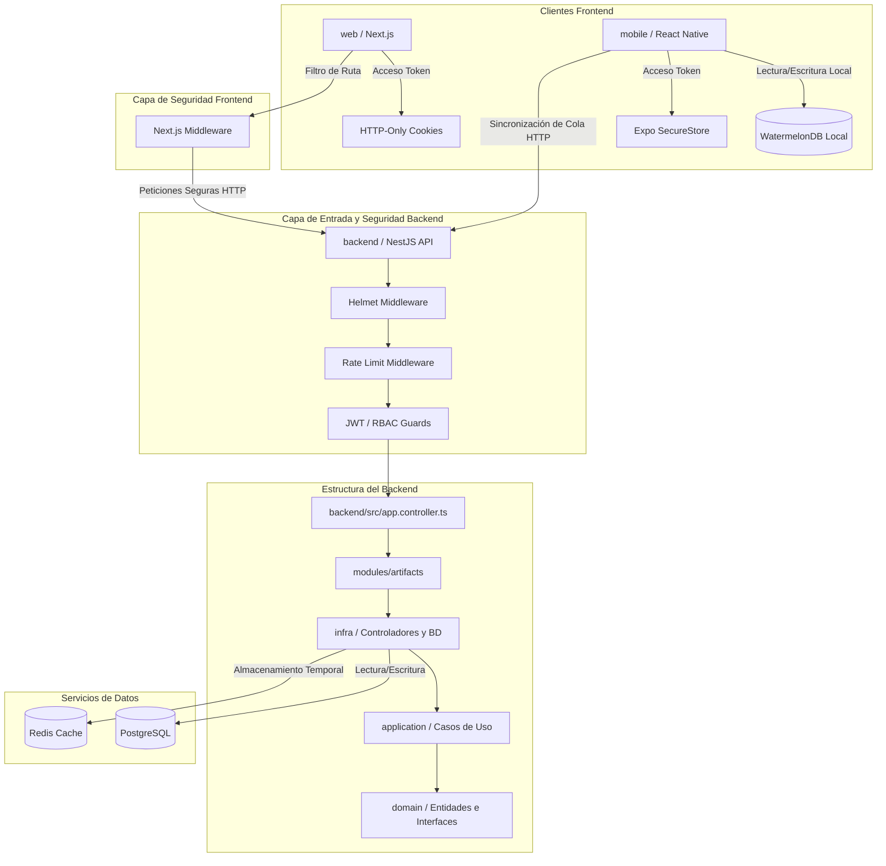

# PLANIFICACIÓN Y ESTRUCTURA DEL PROYECTO

Este documento detalla la estructura organizativa, la arquitectura tecnológica, el flujo de conexión entre componentes y las políticas de nomenclatura del proyecto **Codice**, incorporando el inventario de vistas (UI) y las capas de seguridad requeridas.

---

## 1. ÁRBOL COMPLETO DE DIRECTORIOS (TREE VIEW)

A continuación se detalla la distribución de archivos y carpetas del proyecto, incluyendo los módulos de seguridad y el sistema de vistas:

```text
Codice/ [Raíz del proyecto - Aplicación multi-entorno: Web, Móvil, Backend e Infraestructura]
├── .github/ [Configuraciones de GitHub, flujos de trabajo e Integración y Despliegue Continuo (CI/CD)]
├── .env.example [Plantilla de variables de entorno y secrets de infraestructura]
├── docker-compose.yml [Orquestación de base de datos relacional PostgreSQL y Redis Cache]
├── backend/ [Servicio Backend - API REST y lógica de negocio basada en NestJS]
│   ├── postman/ [Colecciones de endpoints y entornos para pruebas de API]
│   ├── src/ [Código fuente del backend]
│   │   ├── common/ [Módulos transversales y compartidos]
│   │   │   ├── guards/ [Guardianes de validación de JWT, roles y control de acceso - RBAC]
│   │   │   └── middleware/ [Middlewares de seguridad: Helmet para cabeceras y Rate Limiting para DDoS]
│   │   ├── modules/ [Módulos independientes de negocio]
│   │   │   └── artifacts/ [Módulo específico para gestión de artefactos]
│   │   │       ├── application/ [Casos de uso e interfaces de aplicación (Arquitectura Limpia)]
│   │   │       ├── domain/ [Modelos, entidades y reglas críticas del negocio]
│   │   │       └── infra/ [Controladores, adaptadores de persistencia y servicios externos]
│   │   ├── app.controller.ts [Controlador raíz del backend]
│   │   ├── app.module.ts [Módulo raíz que unifica la aplicación]
│   │   ├── app.service.ts [Servicio raíz del backend]
│   │   └── main.ts [Punto de entrada e inicialización de la aplicación NestJS]
│   ├── test/ [Pruebas unitarias y de integración del backend]
│   ├── eslint.config.mjs [Reglas de calidad de código para backend]
│   ├── nest-cli.json [Configuración de compilación y CLI de NestJS]
│   ├── package.json [Dependencias y scripts de ejecución del backend]
│   └── tsconfig.json [Configuración de TypeScript para el backend]
├── mobile/ [Aplicación Móvil - Desarrollada con React Native y Expo]
│   ├── app/ [Sistema de enrutamiento basado en archivos (Expo Router)]
│   │   ├── (auth)/ [Grupo de rutas de acceso seguro y autenticación inicial]
│   │   │   ├── login.tsx [Vista: Acceso inicial con indicador de carga de catálogo]
│   │   │   └── register.tsx [Vista: Registro de nuevos usuarios]
│   │   ├── (tabs)/ [Pantallas principales tras autenticación del usuario]
│   │   │   ├── index.tsx [Vista: Home / Dashboard con Indicador de Red Online/Offline]
│   │   │   ├── scanner.tsx [Vista: Lector de código QR a pantalla completa]
│   │   │   ├── new-artifact.tsx [Vista: Formulario 'Nuevo Hallazgo' con módulo de cámara]
│   │   │   ├── artifact-profile.tsx [Vista: Perfil del Artefacto Escaneado]
│   │   │   ├── transfer-form.tsx [Vista: Formulario de movimiento y actualización de estado]
│   │   │   ├── sync-queue.tsx [Vista: Cola de sincronización offline con barra de progreso]
│   │   │   ├── digital-signature.tsx [Vista: Recepción con Firma Digital en campo]
│   │   │   └── profile.tsx [Vista: Ajustes de perfil y seguridad del usuario]
│   │   └── _layout.tsx [Diseño de navegación raíz y enrutamiento principal]
│   ├── assets/ [Recursos estáticos: imágenes de marca, fuentes e íconos]
│   ├── components/ [Componentes de interfaz de usuario móviles y reutilizables]
│   ├── constants/ [Valores constantes globales como colores, espaciados y temas]
│   ├── hooks/ [Custom hooks de React para lógica de interfaz de usuario]
│   ├── scripts/ [Scripts auxiliares y utilidades de automatización para Expo]
│   ├── services/ [Servicios de persistencia y lógica fuera de la interfaz]
│   │   └── secure-storage/ [Módulo de persistencia segura de tokens mediante Expo SecureStore]
│   ├── app.json [Configuración global de la aplicación en Expo]
│   ├── package.json [Dependencias y scripts de ejecución de la app móvil]
│   └── tsconfig.json [Configuración de TypeScript para la app móvil]
└── web/ [Aplicación Web - Desarrollada con Next.js (App Router)]
    ├── public/ [Recursos estáticos públicos de la web]
    ├── src/ [Código fuente de la aplicación web]
    │   └── app/ [Estructura de rutas y vistas Next.js (App Router)]
    │       ├── (public)/ [Nuevo grupo de rutas para vistas sin autenticación]
    │       │   └── landing/
    │       │       └── page.tsx [Vista: Landing Page del proyecto Códice]
    │       ├── (auth)/ [Grupo de rutas para autenticación web]
    │       │   ├── login/
    │       │   │   └── page.tsx [Vista: Inicio de sesión web]
    │       │   ├── register/
    │       │   │   └── page.tsx [Vista: Registro web]
    │       │   ├── forgot-password/
    │       │   │   └── page.tsx [Vista: Interfaz de Recuperación de Contraseña]
    │       │   └── reset-password/
    │       │       └── page.tsx [Vista: Pantalla de Creación de Nueva Contraseña]
    │       ├── dashboard/
    │       │   └── page.tsx [Vista: Panel Principal con KPIs, Feed de actividad y Alertas]
    │       ├── catalog/
    │       │   ├── page.tsx [Vista: Catálogo General con barra de búsqueda y Data Grid paginado]
    │       │   └── [id]/
    │       │       └── page.tsx [Vista: Ficha Técnica del Artefacto con carrusel e Historial inmutable]
    │       ├── warehouses/
    │       │   └── page.tsx [Vista: Gestión de Almacenes y Zonas con modal de creación]
    │       ├── qr-generator/
    │       │   └── page.tsx [Vista: Generador de códigos QR con vista previa de impresión]
    │       ├── sync-conflicts/
    │       │   └── page.tsx [Vista: Bandeja de Conflictos de Sincronización con vista Split/Diff]
    │       ├── users/
    │       │   └── page.tsx [Vista: Gestión de Usuarios, Roles y Permisiones RBAC]
    │       ├── profile/
    │       │   └── page.tsx [Vista: Perfil de usuario y preferencias (Web)]
    │       ├── dictionaries/
    │       │   └── page.tsx [Vista: Diccionarios del Sistema para Códice (Taxonomías)]
    │       ├── reports/
    │       │   └── page.tsx [Vista: Módulo de Reportes y Exportación]
    │       ├── settings/
    │       │   └── page.tsx [Vista: Configuración Global del sistema]
    │       ├── globals.css [Estilos y directivas CSS globales]
    │       ├── layout.tsx [Estructura y diseño común de la página web]
    │       └── middleware.ts [Middleware de Next.js para protección de rutas del lado del servidor]
    ├── next.config.ts [Configuración del framework Next.js]
    ├── package.json [Dependencias y scripts de ejecución de la web]
    ├── postcss.config.mjs [Configuración del procesamiento de estilos]
    └── tsconfig.json [Configuración de TypeScript para el frontend web]
```

---

## 2. MAPA DE TECNOLOGÍAS Y DEPENDENCIAS

El proyecto sigue un enfoque monorrepo estructurado por entornos separados, compartiendo la misma base tecnológica en su tipado:

### Tecnologías Core (Lenguajes y Entornos de Ejecución)
- **TypeScript**: Lenguaje unificador en todos los subproyectos (Backend, Web y Móvil) para garantizar seguridad en los datos mediante tipado estático.
- **Node.js**: Entorno de ejecución en tiempo de desarrollo y producción para el backend y herramientas frontend.

### Tecnologías, Base de Datos Offline y Seguridad
- **Capa de Datos Local (Mobile)**: WatermelonDB para almacenamiento relacional offline de alta velocidad con sincronización diferida.
- **Autenticación**: JWT (JSON Web Tokens) estructurado para el control de sesiones y encriptación Bcrypt en el Backend para proteger contraseñas.
- **Almacenamiento de Tokens**: 
  - **Móvil**: Expo SecureStore (Keychain en iOS / Keystore en Android) para evitar fugas de credenciales.
  - **Web**: Cookies HTTP-Only con directivas `Secure` y `SameSite=Strict` para mitigar ataques XSS y CSRF.
- **Blindaje de API**: Respaldado por Helmet (cabeceras HTTP seguras) y Rate Limiting en NestJS para mitigar ataques DDoS y fuerza bruta.

### Backend (`backend/`)
- **Framework Principal**: NestJS (v11) - Arquitectura modular para construir APIs eficientes y escalables.
- **Servicios de Infraestructura**:
  - **PostgreSQL**: Base de datos relacional para la persistencia de datos.
  - **Redis**: Sistema de almacenamiento en caché en memoria y colas rápidas.
- **Orquestación**: Docker Compose para empaquetado rápido de base de datos y caché.

### Aplicación Web (`web/`)
- **Framework Principal**: Next.js (v16, App Router) - Renderizado del lado del servidor (SSR) y generación estática (SSG).
- **Librería de UI**: React (v19) y React DOM.
- **Estilos**: Tailwind CSS (v4) para un diseño responsivo y moderno basado en utilidades rápidas.

### Aplicación Móvil (`mobile/`)
- **Framework de Desarrollo**: Expo (SDK 54) y React Native (v0.81) para compilación e interfaces nativas en Android y iOS.
- **Enrutador**: Expo Router (v6) - Enrutamiento intuitivo basado en archivos.
- **Librería de Animaciones**: React Native Reanimated para micro-interacciones de alta fluidez.

---

## 3. FLUJO DE CONEXIÓN Y ARQUITECTURA

La arquitectura del proyecto sigue principios de flujo unidireccional pero con validación estricta de seguridad en cada punto de interacción:



### Mecánica de Integración, Sincronización y Seguridad
1. **Flujo de Navegación Protegido (Frontend)**:
   - **En Web**: `middleware.ts` intercepta cada intento de navegación en Next.js. Si las Cookies HTTP-Only no poseen un JWT válido, se redirige inmediatamente al grupo de rutas `(auth)/login`.
   - **En Móvil**: Las vistas de `mobile/app/(tabs)` están jerárquicamente bloqueadas por Expo Router usando el token persistido en `Expo SecureStore`. Si no hay token, el flujo redirige a `(auth)/login`.

2. **Acceso de Datos Offline y Cola de Sincronización**:
   - La aplicación móvil almacena los cambios localmente en **WatermelonDB**.
   - En caso de desconexión (indicado visualmente en la UI), los cambios se encolan. Al restaurar la conexión, se desencadena el envío de la cola autenticada mediante un proceso de sincronización seguro hacia los endpoints del backend.

3. **Capa de Control de Acceso (Backend)**:
   - **Filtro de Entrada**: Helmet configura de forma automática las cabeceras HTTP de respuesta para prevenir ataques de inyección de código. Rate Limiting bloquea peticiones masivas.
   - **Guardianes (Guards)**: Validan la validez del token JWT y verifican los roles del usuario (RBAC) antes de permitir que la petición acceda a los controladores dentro de `modules/artifacts`.

---

## 4. PROPUESTA DE NOMENCLATURA (CONVENCIÓN DE NOMBRES)

Para garantizar la homogeneidad y evitar fricciones entre desarrolladores en los tres entornos de desarrollo, se define la siguiente directriz de nomenclatura estricta:

### Carpetas y Directorios
- **Regla**: `kebab-case` (letras minúsculas separadas por guiones).
- *Ejemplos*: `modules/`, `core-components/`, `user-profile/`, `secure-storage/`.

### Archivos de Código (TypeScript y Configuración)
- **Componentes Visuales y Vistas (React / React Native)**: `PascalCase` (primera letra de cada palabra en mayúscula).
  - *Ejemplos*: `Button.tsx`, `UserProfileCard.tsx`, `ScannerView.tsx`.
- **Hooks de React**: Prefijo `use` seguido de `camelCase`.
  - *Ejemplos*: `useAuth.ts`, `useLocalStorage.ts`, `useOnlineStatus.ts`.
- **Clases e Interfaces**: `PascalCase` para el nombre del archivo.
  - *Ejemplos*: `CreateUserDto.ts`, `ArtifactEntity.ts`.
- **Servicios, Controladores, Módulos (NestJS)**: Prefijo descriptivo en `kebab-case` con sufijo del tipo.
  - *Ejemplos*: `app.controller.ts`, `artifact.module.ts`, `app.service.ts`.
- **Archivos de Configuración**: Minúsculas completas o `kebab-case`.
  - *Ejemplos*: `next.config.ts`, `eslint.config.js`.

### Variables, Funciones y Métodos
- **Regla**: `camelCase` (primera palabra en minúscula, subsecuentes con inicial mayúscula).
  - *Ejemplos*: `getUserById()`, `isLoading`, `handleSubmit()`.

---

## 5. HOJA DE RUTA Y FASES DE DESARROLLO (ROADMAP)

### FASE 1: Cimientos, Autenticación y Blindaje Inicial
**Objetivo:** Establecer la infraestructura base, la base de datos local/remota y un sistema de inicio de sesión 100% seguro en todas las plataformas.
- **Backend:** Configuración de Docker Compose (Postgres + Redis). Implementación de la base de datos base, hashing de contraseñas con Bcrypt, emisión de JWT y activación de Middlewares de seguridad (Helmet + Rate Limiting).
- **Web:** Configuración inicial del framework con Tailwind CSS. Creación de las vistas del grupo `(auth)` (Login, Registro, Recuperación de Contraseña y Restablecimiento de Contraseña) y del grupo público `(public)/landing` (Landing Page del proyecto). Implementación de `middleware.ts` para capturar e interceptar rutas mediante cookies HTTP-Only.
- **Mobile:** Inicialización con Expo y Expo Router. Configuración de `services/secure-storage/` para persistir tokens de acceso. Diseño de las vistas `login.tsx` y `register.tsx` con su loader de inicialización.
- **Criterio de Cierre (¿Cómo dejarlo listo?):** Un usuario puede registrarse e iniciar sesión de forma segura desde la Web o el Móvil. Las rutas internas están bloqueadas si no existe un token válido.

### FASE 2: Núcleo del Negocio y Operación Local
**Objetivo:** Desarrollar el módulo central de artefactos, permitiendo la lectura, visualización de datos y la recolección de información en campo sin internet.
- **Backend:** Creación del módulo `modules/artifacts` bajo Arquitectura Limpia (`domain`, `application`, `infra`). Endpoints REST para crear, listar y actualizar piezas.
- **Web:** Desarrollo del panel `dashboard/page.tsx` (Métricas/KPIs y feed), `catalog/page.tsx` (Data Grid paginado con filtros), y las interfaces auxiliares de administración como `profile/page.tsx` (Perfil de usuario y preferencias), `dictionaries/page.tsx` (Diccionarios de taxonomías) y `settings/page.tsx` (Configuración global).
- **Mobile:** Configuración completa de WatermelonDB para el almacenamiento local de datos. Creación de las vistas `index.tsx` (Dashboard con indicador de red) y los formularios locales `new-artifact.tsx` y `transfer-form.tsx`.
- **Criterio de Cierre (¿Cómo dejarlo listo?):** El administrador ve métricas y el catálogo en web. El restaurador en campo puede abrir la app y rellenar un nuevo hallazgo guardándolo localmente en su teléfono, con o sin señal.

### FASE 3: Interacción de Hardware y Sincronización Diferida
**Objetivo:** Activar las capacidades nativas del móvil (cámara/QR/firma) y construir la lógica de sincronización para enviar los datos locales al servidor central.
- **Backend:** Desarrollo de endpoints de sincronización masiva (Push/Pull) optimizados. Creación del microservicio asíncrono para generar PDFs de códigos QR.
- **Web:** Implementación de `qr-generator/page.tsx` (cola de impresión y canvas), la vista de detalle `catalog/[id]/page.tsx` con su Historial de movimientos inmutable, y el módulo `reports/page.tsx` (Reportes y Exportación de datos).
- **Mobile:** Implementación de la cámara en `scanner.tsx` para leer códigos QR (con linterna). Activación de `sync-queue.tsx` para procesar la cola de cambios acumulados localmente, y la vista `digital-signature.tsx` para la recepción de artefactos con firma digital en campo.
- **Criterio de Cierre (¿Cómo dejarlo listo?):** Escanear un QR en el móvil abre la ficha de la pieza, la cual puede ser recibida mediante una firma digital trazable. Al recuperar el internet, el botón "Sincronizar" vacía la base de datos local hacia Postgres de forma exitosa.

### FASE 4: Control de Conflictos, Permisos y Despliegue
**Objetivo:** Resolver disputas de datos en la sincronización, refinar permisos de usuario y preparar el entorno para producción.
- **Backend:** Lógica de detección de colisiones de datos. Activación de los `guards/` para Control de Acceso Basado en Roles (RBAC). Configuración final de flujos CI/CD en `.github/`.
- **Web:** Creación de `sync-conflicts/page.tsx` (Pantalla Split/Diff para decidir qué datos guardar) y `users/page.tsx` (Gestión de usuarios y asignación de roles).
- **Mobile:** Ajustes finales en `profile.tsx` y manejo avanzado de excepciones visuales si una sincronización rebota por conflictos.
- **Criterio de Cierre (¿Cómo dejarlo listo?):** Si dos usuarios modifican el mismo artefacto, el sistema web detecta el conflicto y permite resolverlo visualmente. El proyecto queda listo y empaquetado para producción.
