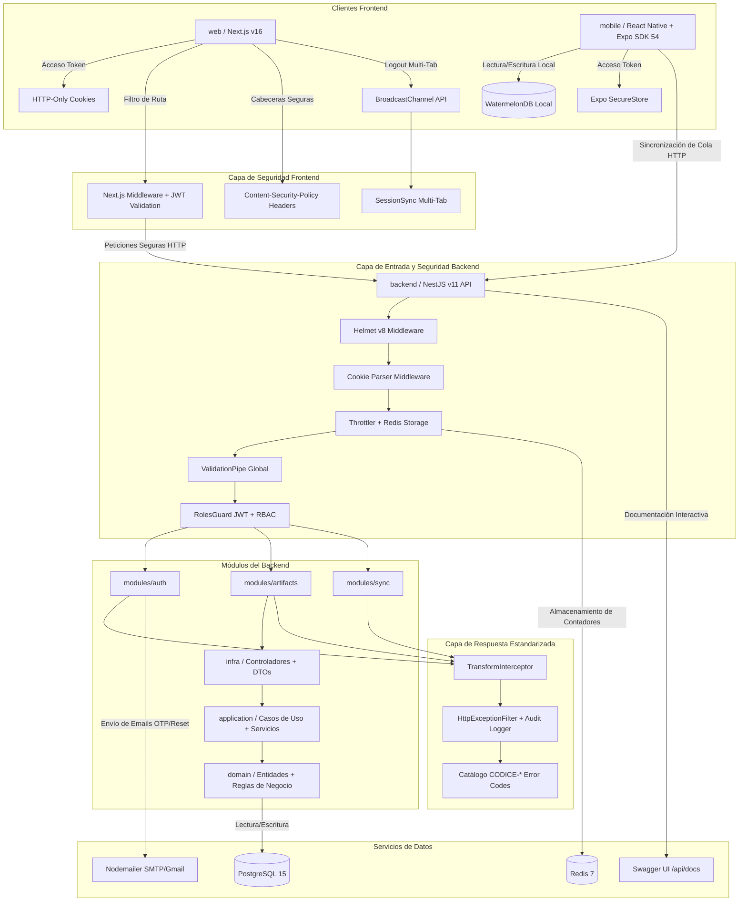
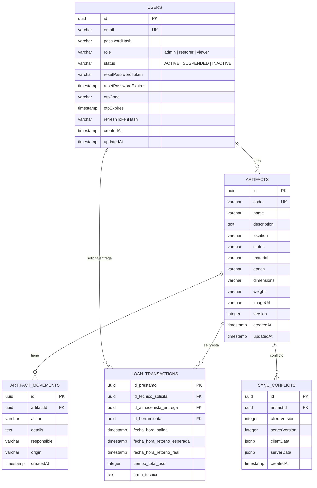

# PLANIFICACIÓN Y ESTRUCTURA DEL PROYECTO

> **Última actualización:** 5 de julio de 2026

Este documento detalla la estructura organizativa, la arquitectura tecnológica, el flujo de conexión entre componentes y las políticas de nomenclatura del proyecto **Codice**, incorporando el inventario de vistas (UI), las capas de seguridad requeridas, los módulos implementados y los servicios de infraestructura activos.

---

## 1. ÁRBOL COMPLETO DE DIRECTORIOS (TREE VIEW)

A continuación se detalla la distribución **real y actualizada** de archivos y carpetas del proyecto, incluyendo los módulos de seguridad, el sistema de vistas, los servicios transversales y los componentes reutilizables implementados:

```text
Codice/ [Raíz del proyecto - Aplicación multi-entorno: Web, Móvil, Backend e Infraestructura]
├── .github/ [Configuraciones de GitHub, flujos de trabajo e Integración y Despliegue Continuo (CI/CD)]
│   └── workflows/ [Directorio para definiciones de pipelines CI/CD (pendiente de configuración)]
├── .env [Variables de entorno y secrets locales del desarrollador (no versionado)]
├── .env.example [Plantilla de variables de entorno y secrets de infraestructura]
├── .gitignore [Reglas de exclusión de archivos del control de versiones]
├── docker-compose.yml [Orquestación de PostgreSQL 15 Alpine y Redis 7 Alpine]
├── GUIA_INICIO.md [Guía rápida para nuevos desarrolladores del proyecto]
├── PLANIFICACION_ESTRUCTURA.md [Este documento: arquitectura, estructura y nomenclatura]
├── planesimplementeacion.md [Histórico de planes de implementación aprobados (Fase 1 y 2)]
├── README.md [Descripción general y presentación del proyecto]
│
├── backend/ [Servicio Backend - API REST y lógica de negocio basada en NestJS]
│   ├── .env [Variables de entorno locales del backend (DATABASE_URL, JWT_SECRET, etc.)]
│   ├── .gitignore [Exclusiones específicas del backend]
│   ├── .prettierrc [Reglas de formato de código Prettier]
│   ├── dist/ [Artefactos compilados de producción (auto-generado por `nest build`)]
│   ├── logs/ [Directorio de registros de auditoría y errores]
│   │   ├── audit.log [Bitácora de auditoría general (Winston)]
│   │   └── error.log [Bitácora de errores no controlados (Winston)]
│   ├── node_modules/ [Dependencias instaladas (auto-generado por npm)]
│   ├── postman/ [Colecciones de endpoints y entornos para pruebas de API]
│   ├── src/ [Código fuente del backend]
│   │   ├── common/ [Módulos transversales, seguridad y utilidades compartidas]
│   │   │   ├── constants/ [Valores constantes globales del backend]
│   │   │   │   └── error-codes.ts [Catálogo de códigos de error CODICE-* con razón y acción sugerida]
│   │   │   ├── filters/ [Filtros globales de excepciones]
│   │   │   │   └── http-exception.filter.ts [Filtro unificado: mapea excepciones HTTP y DB a respuesta estandarizada con audit log]
│   │   │   ├── guards/ [Guardianes de validación de JWT, roles y control de acceso - RBAC]
│   │   │   │   ├── roles.decorator.ts [Decorador @Roles() para anotar endpoints con roles requeridos]
│   │   │   │   └── roles.guard.ts [Guardián RBAC: verifica JWT (cookie o Bearer), valida estado del usuario y roles permitidos]
│   │   │   ├── interceptors/ [Interceptores globales de transformación de respuesta]
│   │   │   │   └── transform.interceptor.ts [Interceptor que envuelve respuestas exitosas en formato { success, data, message }]
│   │   │   ├── middleware/ [Middlewares de seguridad (directorio reservado para expansión)]
│   │   │   ├── audit-logger.ts [Logger centralizado con Winston: consola + archivo audit.log + error.log]
│   │   │   └── throttler-redis-storage.ts [Adaptador de Rate Limiting con Redis (fallback a memoria si Redis no disponible)]
│   │   ├── modules/ [Módulos independientes de negocio]
│   │   │   ├── auth/ [Módulo de Autenticación, Usuarios y Recuperación de Contraseña]
│   │   │   │   ├── dto/ [Objetos de Transferencia de Datos con validación estricta]
│   │   │   │   │   ├── forgot-password.dto.ts [DTO para solicitar recuperación de contraseña]
│   │   │   │   │   ├── login.dto.ts [DTO para inicio de sesión (email + password)]
│   │   │   │   │   ├── register.dto.ts [DTO para registro de nuevos usuarios]
│   │   │   │   │   └── reset-password.dto.ts [DTO para restablecer contraseña con token]
│   │   │   │   ├── auth.controller.ts [Controlador REST: login, register, refresh, forgot/reset-password, OTP, logout]
│   │   │   │   ├── auth.module.ts [Módulo NestJS: registra TypeORM (User), JwtModule, AuthService, MailingService]
│   │   │   │   ├── auth.service.ts [Servicio de autenticación: Bcrypt, JWT dual (access + refresh), OTP, token rotation]
│   │   │   │   ├── mailing.service.ts [Servicio de correo electrónico transaccional vía Nodemailer (SMTP/Gmail)]
│   │   │   │   ├── user.entity.ts [Entidad TypeORM: users (uuid, email, passwordHash, role, status, OTP, tokens)]
│   │   │   │   └── users.controller.ts [Controlador CRUD de usuarios: listar, cambiar rol, cambiar estado (admin only)]
│   │   │   ├── artifacts/ [Módulo específico para gestión de artefactos (Arquitectura Limpia)]
│   │   │   │   ├── application/ [Casos de uso e interfaces de aplicación]
│   │   │   │   │   ├── artifacts.service.ts [Servicio principal: CRUD paginado, búsqueda, movimientos, préstamos, devoluciones]
│   │   │   │   │   └── qr.service.ts [Servicio de generación de códigos QR con la librería qrcode]
│   │   │   │   ├── domain/ [Modelos, entidades y reglas críticas del negocio]
│   │   │   │   │   ├── artifact.entity.ts [Entidad TypeORM: artifacts (uuid, code, name, description, status, versionado)]
│   │   │   │   │   ├── artifact-movement.entity.ts [Entidad TypeORM: artifact_movements (historial inmutable de trazabilidad)]
│   │   │   │   │   └── loan-transaction.entity.ts [Entidad TypeORM: loan_transactions (préstamos con firma digital y tiempos)]
│   │   │   │   ├── infra/ [Controladores, adaptadores de persistencia y DTOs de entrada/salida]
│   │   │   │   │   ├── dto/ [DTOs específicos de artefactos]
│   │   │   │   │   │   ├── create-artifact.dto.ts [DTO de creación de artefacto con validación]
│   │   │   │   │   │   └── update-artifact.dto.ts [DTO de actualización parcial de artefacto]
│   │   │   │   │   ├── artifact.controller.ts [Controlador REST protegido por RBAC: CRUD de artefactos y movimientos]
│   │   │   │   │   └── qr.controller.ts [Controlador REST para generación de códigos QR]
│   │   │   │   └── artifacts.module.ts [Módulo NestJS: registra entidades, servicios y controladores de artefactos]
│   │   │   └── sync/ [Módulo de Sincronización Offline ↔ Online]
│   │   │       ├── sync-conflict.entity.ts [Entidad TypeORM: sync_conflicts (datos cliente vs servidor con versionado)]
│   │   │       ├── sync.controller.ts [Controlador REST: endpoints push y pull para sincronización diferida]
│   │   │       ├── sync.module.ts [Módulo NestJS: registra entidades y servicio de sincronización]
│   │   │       └── sync.service.ts [Servicio de sincronización: push (crear/actualizar/conflictos), pull (delta por timestamp)]
│   │   ├── app.controller.ts [Controlador raíz del backend (health check)]
│   │   ├── app.controller.spec.ts [Test unitario del controlador raíz]
│   │   ├── app.module.ts [Módulo raíz: ConfigModule, TypeORM, ThrottlerModule, AuthModule, ArtifactsModule, SyncModule]
│   │   ├── app.service.ts [Servicio raíz del backend]
│   │   └── main.ts [Punto de entrada: Helmet, CookieParser, CORS, ValidationPipe, Swagger UI, puerto 3001]
│   ├── test/ [Pruebas unitarias y de integración (E2E) del backend]
│   │   ├── app.e2e-spec.ts [Test E2E del controlador raíz]
│   │   ├── artifacts.e2e-spec.ts [Test E2E del módulo de artefactos]
│   │   └── jest-e2e.json [Configuración de Jest para pruebas E2E]
│   ├── test-login.js [Script auxiliar de prueba de login (desarrollo)]
│   ├── test-login-direct.js [Script auxiliar de prueba directa de login]
│   ├── test-login-lowercase.js [Script auxiliar de prueba de login en minúsculas]
│   ├── eslint.config.mjs [Reglas de calidad de código ESLint + Prettier]
│   ├── nest-cli.json [Configuración de compilación y CLI de NestJS]
│   ├── package.json [Dependencias y scripts de ejecución del backend]
│   ├── package-lock.json [Árbol exacto de dependencias (auto-generado)]
│   ├── tsconfig.json [Configuración de TypeScript para el backend]
│   └── tsconfig.build.json [Configuración de compilación TypeScript para producción]
│
├── mobile/ [Aplicación Móvil - Desarrollada con React Native y Expo]
│   ├── .claude/ [Configuración de agentes de IA para el módulo móvil]
│   ├── .env [Variables de entorno locales de la app móvil (API_URL)]
│   ├── .expo/ [Caché interno de Expo (auto-generado)]
│   ├── .gitignore [Exclusiones específicas del módulo móvil]
│   ├── .vscode/ [Configuración de editor para el módulo móvil]
│   ├── AGENTS.md [Directivas de agentes IA para el módulo móvil]
│   ├── CLAUDE.md [Contexto adicional para agentes IA]
│   ├── app/ [Sistema de enrutamiento basado en archivos (Expo Router)]
│   │   ├── (auth)/ [Grupo de rutas de acceso seguro y autenticación inicial]
│   │   │   ├── login.tsx [Vista: Acceso inicial con indicador de carga de catálogo]
│   │   │   └── register.tsx [Vista: Registro de nuevos usuarios]
│   │   ├── (tabs)/ [Pantallas principales tras autenticación del usuario]
│   │   │   ├── _layout.tsx [Layout del sistema de pestañas con navegación inferior]
│   │   │   ├── index.tsx [Vista: Home / Dashboard con Indicador de Red Online/Offline]
│   │   │   ├── scanner.tsx [Vista: Lector de código QR a pantalla completa con linterna]
│   │   │   ├── new-artifact.tsx [Vista: Formulario 'Nuevo Hallazgo' con módulo de cámara]
│   │   │   ├── artifact-profile.tsx [Vista: Perfil del Artefacto Escaneado]
│   │   │   ├── transfer-form.tsx [Vista: Formulario de movimiento y actualización de estado]
│   │   │   ├── sync-queue.tsx [Vista: Cola de sincronización offline con barra de progreso]
│   │   │   ├── digital-signature.tsx [Vista: Recepción con Firma Digital en campo]
│   │   │   ├── explore.tsx [Vista: Exploración y navegación de artefactos]
│   │   │   └── profile.tsx [Vista: Ajustes de perfil y seguridad del usuario]
│   │   ├── _layout.tsx [Diseño de navegación raíz y enrutamiento principal]
│   │   └── modal.tsx [Componente modal reutilizable para diálogos nativos]
│   ├── assets/ [Recursos estáticos: imágenes de marca, fuentes e íconos]
│   │   └── images/ [Imágenes de la app (íconos Android/iOS, splash, favicon)]
│   ├── components/ [Componentes de interfaz de usuario móviles y reutilizables]
│   │   ├── ui/ [Componentes primitivos de UI]
│   │   │   ├── collapsible.tsx [Componente colapsable animado]
│   │   │   ├── icon-symbol.tsx [Wrapper de íconos multiplataforma]
│   │   │   └── icon-symbol.ios.tsx [Variante iOS de íconos con SF Symbols]
│   │   ├── external-link.tsx [Componente para enlaces externos (abre navegador)]
│   │   ├── haptic-tab.tsx [Tab con retroalimentación háptica al pulsar]
│   │   ├── hello-wave.tsx [Animación de saludo (onboarding)]
│   │   ├── parallax-scroll-view.tsx [ScrollView con efecto parallax en cabecera]
│   │   ├── themed-text.tsx [Texto con soporte de tema claro/oscuro]
│   │   └── themed-view.tsx [Vista con soporte de tema claro/oscuro]
│   ├── constants/ [Valores constantes globales]
│   │   └── theme.ts [Definición del tema: colores, espaciados y tipografía]
│   ├── database/ [Capa de datos local offline con WatermelonDB]
│   │   ├── models/ [Modelos de WatermelonDB (ORM local)]
│   │   │   ├── Artifact.ts [Modelo WatermelonDB: artifacts (espejo local del artefacto)]
│   │   │   └── ArtifactMovement.ts [Modelo WatermelonDB: artifact_movements (historial local)]
│   │   ├── index.ts [Inicialización y configuración de la base de datos WatermelonDB]
│   │   └── schema.ts [Definición del esquema relacional local (tablas y columnas)]
│   ├── hooks/ [Custom hooks de React para lógica de interfaz de usuario]
│   │   ├── use-color-scheme.ts [Hook para detectar esquema de color nativo]
│   │   ├── use-color-scheme.web.ts [Variante web del hook de esquema de color]
│   │   └── use-theme-color.ts [Hook para obtener colores del tema activo]
│   ├── scripts/ [Scripts auxiliares y utilidades de automatización para Expo]
│   │   └── reset-project.js [Script para resetear el proyecto Expo a estado limpio]
│   ├── services/ [Servicios de persistencia y lógica fuera de la interfaz]
│   │   └── secure-storage/ [Módulo de persistencia segura de tokens]
│   │       └── secure-store.service.ts [Servicio de almacenamiento cifrado vía Expo SecureStore (Keychain/Keystore)]
│   ├── app.json [Configuración global de la aplicación en Expo (nombre, slug, SDK, íconos)]
│   ├── eslint.config.js [Reglas de calidad de código ESLint para Expo]
│   ├── expo-env.d.ts [Declaraciones de tipos para el entorno Expo]
│   ├── package.json [Dependencias y scripts de ejecución de la app móvil]
│   ├── package-lock.json [Árbol exacto de dependencias (auto-generado)]
│   ├── README.md [Documentación y guía rápida del módulo móvil]
│   └── tsconfig.json [Configuración de TypeScript para la app móvil]
│
└── web/ [Aplicación Web - Desarrollada con Next.js (App Router)]
    ├── .env [Variables de entorno locales de la web (NEXT_PUBLIC_API_URL)]
    ├── .gitignore [Exclusiones específicas del módulo web]
    ├── .next/ [Caché de compilación Next.js (auto-generado)]
    ├── node_modules/ [Dependencias instaladas (auto-generado)]
    ├── public/ [Recursos estáticos públicos de la web (SVGs por defecto)]
    ├── src/ [Código fuente de la aplicación web]
    │   ├── app/ [Estructura de rutas y vistas Next.js (App Router)]
    │   │   ├── (public)/ [Grupo de rutas para vistas sin autenticación]
    │   │   │   └── landing/
    │   │   │       └── page.tsx [Vista: Landing Page del proyecto Códice]
    │   │   ├── (auth)/ [Grupo de rutas para autenticación web]
    │   │   │   ├── login/
    │   │   │   │   └── page.tsx [Vista: Inicio de sesión web]
    │   │   │   ├── register/
    │   │   │   │   └── page.tsx [Vista: Registro web]
    │   │   │   ├── forgot-password/
    │   │   │   │   └── page.tsx [Vista: Interfaz de Recuperación de Contraseña]
    │   │   │   └── reset-password/
    │   │   │       └── page.tsx [Vista: Pantalla de Creación de Nueva Contraseña]
    │   │   ├── dashboard/
    │   │   │   └── page.tsx [Vista: Panel Principal con KPIs, Feed de actividad y Alertas]
    │   │   ├── catalog/
    │   │   │   ├── page.tsx [Vista: Catálogo General con barra de búsqueda y Data Grid paginado]
    │   │   │   └── [id]/
    │   │   │       └── page.tsx [Vista: Ficha Técnica del Artefacto con carrusel e Historial inmutable]
    │   │   ├── warehouses/
    │   │   │   └── page.tsx [Vista: Gestión de Almacenes y Zonas con modal de creación]
    │   │   ├── qr-generator/
    │   │   │   └── page.tsx [Vista: Generador de códigos QR con vista previa de impresión]
    │   │   ├── operations/ [Módulo de Operaciones de préstamos y devoluciones]
    │   │   │   ├── loans/
    │   │   │   │   └── page.tsx [Vista: Registro y gestión de préstamos de herramientas/artefactos]
    │   │   │   └── returns/
    │   │   │       └── page.tsx [Vista: Registro de devoluciones con firma y tiempo de uso]
    │   │   ├── my-loans/
    │   │   │   └── page.tsx [Vista: Mis Préstamos activos (vista del técnico/restaurador)]
    │   │   ├── sync-conflicts/
    │   │   │   └── page.tsx [Vista: Bandeja de Conflictos de Sincronización con vista Split/Diff]
    │   │   ├── users/
    │   │   │   └── page.tsx [Vista: Gestión de Usuarios, Roles y Permisos RBAC]
    │   │   ├── profile/
    │   │   │   └── page.tsx [Vista: Perfil de usuario y preferencias (Web)]
    │   │   ├── dictionaries/
    │   │   │   └── page.tsx [Vista: Diccionarios del Sistema para Códice (Taxonomías)]
    │   │   ├── reports/
    │   │   │   └── page.tsx [Vista: Módulo de Reportes y Exportación]
    │   │   ├── settings/
    │   │   │   └── page.tsx [Vista: Configuración Global del sistema]
    │   │   ├── globals.css [Estilos y directivas CSS globales con Tailwind CSS]
    │   │   ├── layout.tsx [Layout raíz: metadata SEO, SessionSync, Toaster (Sonner), Google Fonts]
    │   │   ├── page.tsx [Página raíz (redirección al landing o dashboard)]
    │   │   └── favicon.ico [Ícono de la aplicación web]
    │   ├── components/ [Componentes reutilizables de la interfaz web]
    │   │   ├── ui/ [Componentes primitivos y atómicos de UI]
    │   │   │   └── SkeletonCatalog.tsx [Componente esqueleto de carga para el catálogo]
    │   │   ├── Header.tsx [Componente de cabecera global con navegación y sesión]
    │   │   ├── SessionSync.tsx [Componente de sincronización de sesión entre pestañas (BroadcastChannel)]
    │   │   ├── Sidebar.tsx [Componente de barra lateral de navegación principal]
    │   │   └── Toast.tsx [Componente wrapper de notificaciones toast]
    │   └── middleware.ts [Middleware de Next.js: protección de rutas del lado del servidor con validación JWT]
    ├── eslint.config.mjs [Reglas de calidad de código ESLint para Next.js]
    ├── next.config.ts [Configuración de Next.js con cabeceras CSP (Content-Security-Policy)]
    ├── next-env.d.ts [Declaraciones de tipos para el entorno Next.js]
    ├── package.json [Dependencias y scripts de ejecución de la web]
    ├── package-lock.json [Árbol exacto de dependencias (auto-generado)]
    ├── postcss.config.mjs [Configuración del procesamiento de estilos con PostCSS + Tailwind]
    ├── README.md [Documentación y guía rápida del módulo web]
    └── tsconfig.json [Configuración de TypeScript para el frontend web]
```

---

## 2. MAPA DE TECNOLOGÍAS Y DEPENDENCIAS

El proyecto sigue un enfoque monorrepo estructurado por entornos separados, compartiendo la misma base tecnológica en su tipado:

### Tecnologías Core (Lenguajes y Entornos de Ejecución)
- **TypeScript**: Lenguaje unificador en todos los subproyectos (Backend, Web y Móvil) para garantizar seguridad en los datos mediante tipado estático.
- **Node.js**: Entorno de ejecución en tiempo de desarrollo y producción para el backend y herramientas frontend.

### Tecnologías, Base de Datos Offline y Seguridad
- **Capa de Datos Local (Mobile)**: WatermelonDB (`@nozbe/watermelondb` v0.28) para almacenamiento relacional offline de alta velocidad con sincronización diferida. Esquema local con tablas `artifacts` y `artifact_movements`.
- **Autenticación Multi-Factor**:
  - **JWT Dual**: Access Token (15 min) + Refresh Token (7 días) con rotación automática en cada uso.
  - **Bcrypt**: Hashing de contraseñas con salt cost 12 para proteger credenciales.
  - **OTP por Email**: Código de verificación de 6 dígitos con expiración configurable (15 min por defecto), generado criptográficamente (`crypto.randomInt`).
  - **Recuperación de Contraseña**: Token criptográfico de 32 bytes con expiración de 15 minutos, enviado por email con plantilla HTML.
- **Almacenamiento de Tokens**:
  - **Móvil**: Expo SecureStore (Keychain en iOS / Keystore en Android) para evitar fugas de credenciales.
  - **Web**: Cookies HTTP-Only con directivas `Secure` y `SameSite=Strict` para mitigar ataques XSS y CSRF.
- **Blindaje de API**:
  - **Helmet v8**: Cabeceras HTTP seguras con CSP desactivado temporalmente para Swagger UI en desarrollo.
  - **Rate Limiting Multinivel**: Throttler global (100 req / 15 min) y throttler de autenticación (5 req / 1 min), almacenamiento en Redis con fallback automático a memoria.
  - **Content-Security-Policy (Web)**: Cabecera CSP configurada en `next.config.ts` para restringir orígenes de scripts, estilos, fuentes, imágenes y conexiones.
- **Respuesta Estandarizada**: Interceptor global `TransformInterceptor` que envuelve todas las respuestas exitosas en formato `{ success, data, message }`.
- **Manejo de Errores Centralizado**: Filtro global `HttpExceptionFilter` con catálogo de códigos de error `CODICE-*`, audit logging con Winston y manejo seguro de violaciones de BD (unique/foreign key).
- **Sincronización de Sesión Multi-Pestaña**: Componente `SessionSync` usando `BroadcastChannel API` para propagar logout entre pestañas del navegador.

### Backend (`backend/`)
- **Framework Principal**: NestJS (v11) - Arquitectura modular para construir APIs eficientes y escalables.
- **ORM**: TypeORM (v1) con entidades tipadas y migraciones manuales.
- **Documentación API**: Swagger UI (`@nestjs/swagger` v11) disponible en `/api/docs` con autenticación Bearer.
- **Validación**: `class-validator` + `class-transformer` con `ValidationPipe` global (whitelist + forbidNonWhitelisted + transform).
- **Correo Transaccional**: Nodemailer (v9) con soporte SMTP/Gmail para envío de OTP y recuperación de contraseña.
- **Generación QR**: Librería `qrcode` (v1.5) para generación programática de códigos QR.
- **Generación PDF**: PDFKit (v0.19) para generación de documentos PDF.
- **Logging Estructurado**: Winston (v3.19) con transporte a consola, audit.log y error.log.
- **Servicios de Infraestructura**:
  - **PostgreSQL 15 Alpine**: Base de datos relacional para la persistencia de datos (local via Docker o remota en Render).
  - **Redis 7 Alpine**: Sistema de almacenamiento en caché en memoria para Rate Limiting y colas rápidas.
- **Orquestación**: Docker Compose para empaquetado rápido de base de datos y caché.

### Aplicación Web (`web/`)
- **Framework Principal**: Next.js (v16, App Router) - Renderizado del lado del servidor (SSR) y generación estática (SSG).
- **Librería de UI**: React (v19) y React DOM.
- **Estilos**: Tailwind CSS (v4) para un diseño responsivo y moderno basado en utilidades rápidas.
- **Data Fetching**: SWR (v2.4) para cache y revalidación automática de datos del servidor.
- **Notificaciones**: Sonner (v2) para notificaciones toast interactivas.
- **Generación QR (Frontend)**: qrcode.react (v4.2) para renderizado de códigos QR en canvas/SVG.

### Aplicación Móvil (`mobile/`)
- **Framework de Desarrollo**: Expo (SDK 54) y React Native (v0.81) para compilación e interfaces nativas en Android y iOS.
- **Enrutador**: Expo Router (v6) - Enrutamiento intuitivo basado en archivos.
- **Librería de Animaciones**: React Native Reanimated (v4.1) para micro-interacciones de alta fluidez.
- **Cámara y QR**: expo-camera (v57) para escaneo de códigos QR con linterna.
- **Conectividad**: expo-network (v57) para detección de estado online/offline.
- **Almacenamiento Seguro**: expo-secure-store (v57) para persistencia cifrada de tokens.
- **Base de Datos Local**: WatermelonDB (`@nozbe/watermelondb` v0.28) + `@nozbe/with-observables` (v1.6) para reactividad.

---

## 3. FLUJO DE CONEXIÓN Y ARQUITECTURA

La arquitectura del proyecto sigue principios de flujo unidireccional pero con validación estricta de seguridad en cada punto de interacción:



### Mecánica de Integración, Sincronización y Seguridad

1. **Flujo de Navegación Protegido (Frontend)**:
   - **En Web**: `middleware.ts` (ubicado en `web/src/`) intercepta cada intento de navegación a rutas protegidas (`/dashboard`, `/catalog`, `/settings`, `/reports`, `/users`, `/sync-conflicts`, `/warehouses`, `/qr-generator`, `/dictionaries`, `/profile`). Si las Cookies HTTP-Only no poseen un JWT válido o el token ha expirado (verificación de campo `exp` del payload), se redirige inmediatamente al grupo de rutas `(auth)/login`.
   - **En Web (CSP)**: `next.config.ts` define cabeceras `Content-Security-Policy` que restringen los orígenes de scripts, estilos, fuentes, imágenes y conexiones API, previniendo ataques XSS y data exfiltration.
   - **En Web (Multi-Tab)**: El componente `SessionSync` utiliza la `BroadcastChannel API` para propagar eventos de logout entre todas las pestañas abiertas del navegador, invalidando la sesión de forma simultánea.
   - **En Móvil**: Las vistas de `mobile/app/(tabs)` están jerárquicamente bloqueadas por Expo Router usando el token persistido en `Expo SecureStore`. Si no hay token, el flujo redirige a `(auth)/login`.

2. **Acceso de Datos Offline y Cola de Sincronización**:
   - La aplicación móvil almacena los cambios localmente en **WatermelonDB** con un esquema definido en `database/schema.ts` y modelos en `database/models/` (`Artifact.ts`, `ArtifactMovement.ts`).
   - En caso de desconexión (detectada por `expo-network` e indicada visualmente en la UI), los cambios se encolan. Al restaurar la conexión, se desencadena el envío de la cola autenticada mediante los endpoints `POST /api/sync/push` (envío de cambios al servidor) y `GET /api/sync/pull` (descarga de cambios desde el servidor con delta por timestamp).
   - **Detección de Conflictos**: Cuando un artefacto ha sido modificado por otro usuario mientras el dispositivo estaba offline (version mismatch), el servicio de sincronización crea un registro en `sync_conflicts` con los datos del cliente y del servidor para resolución visual en la web.

3. **Capa de Control de Acceso (Backend)**:
   - **Pipeline de Entrada**: Las peticiones atraviesan secuencialmente Helmet → CookieParser → Rate Limiter (Redis) → ValidationPipe → RolesGuard.
   - **Guardianes (Guards)**: El `RolesGuard` valida la existencia y validez del token JWT (extraído de cookie `auth_token` o cabecera `Authorization: Bearer`), verifica que el usuario exista en la BD, que su estado sea `ACTIVE` (rechaza `SUSPENDED`), y que su rol coincida con los roles requeridos por el decorador `@Roles()` del endpoint.
   - **Roles del Sistema**: `admin` (acceso total), `restorer` (operaciones de campo y catálogo), `viewer` (solo lectura).
   - **Respuesta Estandarizada**: Todas las respuestas exitosas son envueltas por `TransformInterceptor` en formato `{ success: true, data, message }`. Todas las excepciones son capturadas por `HttpExceptionFilter` que las mapea a `{ success: false, code, error, message, reason, action, timestamp }` con códigos del catálogo `CODICE-*`.

4. **Sistema de Auditoría y Trazabilidad**:
   - **Audit Logger**: Winston registra errores no controlados con ID único (`ERR-XXXXXXXX`) en `logs/audit.log` y `logs/error.log`.
   - **Historial Inmutable**: Cada operación sobre un artefacto (creación, traslado, préstamo, devolución, sincronización) genera un registro en `artifact_movements` que no se puede eliminar ni modificar.
   - **Préstamos Trazables**: La entidad `loan_transactions` registra quién solicita, quién entrega, tiempos de salida/retorno y firma digital Base64 del técnico.

---

## 4. INVENTARIO DE VISTAS (UI)

### 4.1 Vistas Web (Next.js - App Router)

| Ruta | Archivo | Descripción | Autenticación |
|------|---------|-------------|:-------------:|
| `/landing` | `(public)/landing/page.tsx` | Landing Page del proyecto Códice | ❌ Pública |
| `/login` | `(auth)/login/page.tsx` | Inicio de sesión web | ❌ Pública |
| `/register` | `(auth)/register/page.tsx` | Registro de nuevos usuarios | ❌ Pública |
| `/forgot-password` | `(auth)/forgot-password/page.tsx` | Solicitud de recuperación de contraseña | ❌ Pública |
| `/reset-password` | `(auth)/reset-password/page.tsx` | Restablecimiento de contraseña con token | ❌ Pública |
| `/dashboard` | `dashboard/page.tsx` | Panel Principal: KPIs, Feed de actividad, Alertas | ✅ Protegida |
| `/catalog` | `catalog/page.tsx` | Catálogo General: búsqueda, Data Grid paginado, filtros | ✅ Protegida |
| `/catalog/[id]` | `catalog/[id]/page.tsx` | Ficha Técnica del Artefacto: carrusel, historial inmutable | ✅ Protegida |
| `/warehouses` | `warehouses/page.tsx` | Gestión de Almacenes y Zonas con modal de creación | ✅ Protegida |
| `/qr-generator` | `qr-generator/page.tsx` | Generador de códigos QR con vista previa de impresión | ✅ Protegida |
| `/operations/loans` | `operations/loans/page.tsx` | Registro y gestión de préstamos de herramientas | ✅ Protegida |
| `/operations/returns` | `operations/returns/page.tsx` | Registro de devoluciones con firma y tiempo de uso | ✅ Protegida |
| `/my-loans` | `my-loans/page.tsx` | Mis Préstamos activos (vista del técnico/restaurador) | ✅ Protegida |
| `/sync-conflicts` | `sync-conflicts/page.tsx` | Bandeja de Conflictos de Sincronización (Split/Diff) | ✅ Protegida |
| `/users` | `users/page.tsx` | Gestión de Usuarios, Roles y Permisos RBAC | ✅ Protegida (admin) |
| `/profile` | `profile/page.tsx` | Perfil de usuario y preferencias | ✅ Protegida |
| `/dictionaries` | `dictionaries/page.tsx` | Diccionarios del Sistema (Taxonomías) | ✅ Protegida |
| `/reports` | `reports/page.tsx` | Módulo de Reportes y Exportación | ✅ Protegida |
| `/settings` | `settings/page.tsx` | Configuración Global del sistema | ✅ Protegida |

### 4.2 Componentes Web Compartidos

| Componente | Archivo | Descripción |
|------------|---------|-------------|
| `Header` | `components/Header.tsx` | Cabecera global con navegación y controles de sesión |
| `Sidebar` | `components/Sidebar.tsx` | Barra lateral de navegación principal |
| `SessionSync` | `components/SessionSync.tsx` | Sincronización de sesión entre pestañas (BroadcastChannel) |
| `Toast` | `components/Toast.tsx` | Wrapper de notificaciones toast |
| `SkeletonCatalog` | `components/ui/SkeletonCatalog.tsx` | Esqueleto de carga para el catálogo |

### 4.3 Vistas Móvil (Expo Router)

| Ruta | Archivo | Descripción | Autenticación |
|------|---------|-------------|:-------------:|
| `(auth)/login` | `app/(auth)/login.tsx` | Acceso inicial con indicador de carga | ❌ Pública |
| `(auth)/register` | `app/(auth)/register.tsx` | Registro de nuevos usuarios | ❌ Pública |
| `(tabs)/index` | `app/(tabs)/index.tsx` | Home / Dashboard con indicador de red | ✅ Protegida |
| `(tabs)/scanner` | `app/(tabs)/scanner.tsx` | Lector de código QR a pantalla completa con linterna | ✅ Protegida |
| `(tabs)/new-artifact` | `app/(tabs)/new-artifact.tsx` | Formulario 'Nuevo Hallazgo' con módulo de cámara | ✅ Protegida |
| `(tabs)/artifact-profile` | `app/(tabs)/artifact-profile.tsx` | Perfil del Artefacto Escaneado | ✅ Protegida |
| `(tabs)/transfer-form` | `app/(tabs)/transfer-form.tsx` | Formulario de movimiento y actualización de estado | ✅ Protegida |
| `(tabs)/sync-queue` | `app/(tabs)/sync-queue.tsx` | Cola de sincronización offline con barra de progreso | ✅ Protegida |
| `(tabs)/digital-signature` | `app/(tabs)/digital-signature.tsx` | Recepción con Firma Digital en campo | ✅ Protegida |
| `(tabs)/explore` | `app/(tabs)/explore.tsx` | Exploración y navegación de artefactos | ✅ Protegida |
| `(tabs)/profile` | `app/(tabs)/profile.tsx` | Ajustes de perfil y seguridad del usuario | ✅ Protegida |

---

## 5. CAPAS DE SEGURIDAD

### 5.1 Matriz de Seguridad por Capa

```mermaid
graph LR
    subgraph Layer1 [Capa 1: Perímetro de Red]
        Helmet[Helmet v8 - Cabeceras HTTP]
        CSP[Content-Security-Policy]
        CORS[CORS con Credenciales]
    end

    subgraph Layer2 [Capa 2: Control de Flujo]
        RateLimit[Rate Limiting Multinivel]
        Redis[(Redis Storage)]
        Memory[(Memory Fallback)]
    end

    subgraph Layer3 [Capa 3: Autenticación]
        JWT[JWT Dual - Access + Refresh]
        Bcrypt[Bcrypt Salt 12]
        OTP[OTP Criptográfico 6 dígitos]
        CookieSecure[Cookies HTTP-Only + Secure + SameSite]
    end

    subgraph Layer4 [Capa 4: Autorización]
        RBAC[RolesGuard RBAC]
        StatusCheck[Verificación de Estado de Usuario]
        TokenRotation[Rotación de Refresh Token]
    end

    subgraph Layer5 [Capa 5: Validación de Datos]
        ClassValidator[class-validator + class-transformer]
        Whitelist[Whitelist + ForbidNonWhitelisted]
        HTMLEscape[Escape HTML en Emails]
    end

    subgraph Layer6 [Capa 6: Auditoría y Respuesta]
        AuditLog[Winston Audit Logger]
        ErrorCatalog[Catálogo CODICE-* Error Codes]
        DBViolation[Manejo de Violaciones PostgreSQL]
    end

    Layer1 --> Layer2
    Layer2 --> Layer3
    Layer3 --> Layer4
    Layer4 --> Layer5
    Layer5 --> Layer6
    RateLimit --> Redis
    RateLimit -.->|Fallback| Memory
```



### 5.2 Catálogo de Códigos de Error

| Código | Razón | Acción Sugerida |
|--------|-------|-----------------|
| `CODICE-AUTH-001` | Credenciales inválidas, contraseña errónea o cuenta inactiva | Verificar correo y contraseña o solicitar OTP |
| `CODICE-AUTH-002` | Código OTP inválido o expirado | Solicitar nuevo código OTP |
| `CODICE-AUTH-003` | Cuenta suspendida por el administrador | Contactar al administrador del sistema |
| `CODICE-DB-023` | Violación de integridad referencial en la BD | Asegurar que los recursos vinculados existan |
| `CODICE-DB-024` | Registro duplicado en la base de datos | Verificar que el identificador no esté duplicado |
| `CODICE-SYS-500` | Error inesperado al procesar la solicitud | Proporcionar código de referencia a soporte |

### 5.3 Configuración de Rate Limiting

| Throttler | Ventana | Límite | Aplicación |
|-----------|---------|--------|------------|
| `default` | 15 minutos | 100 peticiones | Todos los endpoints |
| `auth` | 1 minuto | 5 peticiones | Endpoints de autenticación |

---

## 6. ENDPOINTS DE LA API REST

### 6.1 Autenticación (`/api/auth/`)

| Método | Endpoint | Descripción | Auth |
|--------|----------|-------------|------|
| `POST` | `/api/auth/register` | Registro de nuevo usuario | ❌ |
| `POST` | `/api/auth/login` | Inicio de sesión (retorna JWT en cookie) | ❌ |
| `POST` | `/api/auth/forgot-password` | Solicitud de recuperación de contraseña | ❌ |
| `POST` | `/api/auth/reset-password` | Restablecimiento de contraseña con token | ❌ |
| `POST` | `/api/auth/request-otp` | Solicitud de código OTP por email | ❌ |
| `POST` | `/api/auth/verify-otp` | Verificación de código OTP | ❌ |
| `POST` | `/api/auth/refresh` | Rotación de tokens (access + refresh) | ✅ |
| `POST` | `/api/auth/validate` | Validación de token activo | ✅ |
| `POST` | `/api/auth/logout` | Cierre de sesión y revocación de tokens | ✅ |

### 6.2 Usuarios (`/api/users/`)

| Método | Endpoint | Descripción | Auth | Rol |
|--------|----------|-------------|------|-----|
| `GET` | `/api/users` | Listado paginado de usuarios | ✅ | admin |
| `PATCH` | `/api/users/:id/role` | Cambiar rol de un usuario | ✅ | admin |
| `PATCH` | `/api/users/:id/status` | Cambiar estado de un usuario | ✅ | admin |

### 6.3 Artefactos (`/api/artifacts/`)

| Método | Endpoint | Descripción | Auth | Rol |
|--------|----------|-------------|------|-----|
| `GET` | `/api/artifacts` | Listado paginado con búsqueda y filtros | ✅ | Todos |
| `GET` | `/api/artifacts/:id` | Detalle de un artefacto | ✅ | Todos |
| `POST` | `/api/artifacts` | Crear nuevo artefacto | ✅ | admin, restorer |
| `PATCH` | `/api/artifacts/:id` | Actualizar artefacto | ✅ | admin, restorer |
| `GET` | `/api/artifacts/:id/movements` | Historial de movimientos | ✅ | Todos |

### 6.4 Códigos QR (`/api/qr/`)

| Método | Endpoint | Descripción | Auth |
|--------|----------|-------------|------|
| `GET` | `/api/qr/:code` | Generar código QR para un artefacto | ✅ |

### 6.5 Sincronización (`/api/sync/`)

| Método | Endpoint | Descripción | Auth |
|--------|----------|-------------|------|
| `POST` | `/api/sync/push` | Envío de cambios offline al servidor | ✅ |
| `GET` | `/api/sync/pull` | Descarga de cambios desde el servidor (delta) | ✅ |

---

## 7. MODELO DE DATOS (ENTIDADES)

### 7.1 Entidades de TypeORM (PostgreSQL)



### 7.2 Modelos de WatermelonDB (Mobile - SQLite Local)

| Tabla | Campos | Descripción |
|-------|--------|-------------|
| `artifacts` | id, code, name, description, location, status, material, epoch, dimensions, weight, imageUrl | Espejo local del artefacto para operación offline |
| `artifact_movements` | id, artifactId, action, details, responsible, origin | Historial local de movimientos |

---

## 8. PROPUESTA DE NOMENCLATURA (CONVENCIÓN DE NOMBRES)

Para garantizar la homogeneidad y evitar fricciones entre desarrolladores en los tres entornos de desarrollo, se define la siguiente directriz de nomenclatura estricta:

### Carpetas y Directorios
- **Regla**: `kebab-case` (letras minúsculas separadas por guiones).
- *Ejemplos*: `modules/`, `core-components/`, `user-profile/`, `secure-storage/`, `sync-conflicts/`.

### Archivos de Código (TypeScript y Configuración)
- **Componentes Visuales y Vistas (React / React Native)**: `PascalCase` (primera letra de cada palabra en mayúscula).
  - *Ejemplos*: `Header.tsx`, `SessionSync.tsx`, `SkeletonCatalog.tsx`, `Sidebar.tsx`.
- **Hooks de React**: Prefijo `use` seguido de `camelCase` o `kebab-case`.
  - *Ejemplos*: `use-color-scheme.ts`, `use-theme-color.ts`.
- **Clases e Interfaces**: `PascalCase` para el nombre del archivo.
  - *Ejemplos*: `CreateArtifactDto.ts`, `ArtifactEntity.ts`.
- **Entidades TypeORM**: Sufijo descriptivo con `.entity.ts` en `kebab-case`.
  - *Ejemplos*: `user.entity.ts`, `artifact.entity.ts`, `loan-transaction.entity.ts`, `sync-conflict.entity.ts`.
- **DTOs de Validación**: Sufijo descriptivo con `.dto.ts` en `kebab-case`.
  - *Ejemplos*: `create-artifact.dto.ts`, `login.dto.ts`, `reset-password.dto.ts`.
- **Servicios, Controladores, Módulos (NestJS)**: Prefijo descriptivo en `kebab-case` con sufijo del tipo.
  - *Ejemplos*: `auth.controller.ts`, `artifacts.service.ts`, `sync.module.ts`, `mailing.service.ts`.
- **Modelos WatermelonDB (Mobile)**: `PascalCase` para el nombre del archivo.
  - *Ejemplos*: `Artifact.ts`, `ArtifactMovement.ts`.
- **Archivos de Configuración**: Minúsculas completas o `kebab-case`.
  - *Ejemplos*: `next.config.ts`, `eslint.config.mjs`, `postcss.config.mjs`, `tsconfig.json`.

### Variables, Funciones y Métodos
- **Regla**: `camelCase` (primera palabra en minúscula, subsecuentes con inicial mayúscula).
  - *Ejemplos*: `getUserById()`, `isLoading`, `handleSubmit()`, `passwordHash`, `refreshTokenHash`.

### Códigos de Error
- **Regla**: Prefijo `CODICE-` seguido de categoría y número secuencial.
  - *Ejemplos*: `CODICE-AUTH-001`, `CODICE-DB-023`, `CODICE-SYS-500`.

---

## 9. HOJA DE RUTA Y FASES DE DESARROLLO (ROADMAP)

### FASE 1: Cimientos, Autenticación y Blindaje Inicial ✅ COMPLETADA
**Objetivo:** Establecer la infraestructura base, la base de datos local/remota y un sistema de inicio de sesión 100% seguro en todas las plataformas.
- **Backend:** ✅ Configuración de Docker Compose (Postgres 15 + Redis 7). Implementación de la base de datos base con TypeORM, hashing de contraseñas con Bcrypt (salt 12), emisión de JWT dual (access 15min + refresh 7d) con rotación, activación de Middlewares de seguridad (Helmet v8 + Rate Limiting multinivel con Redis + fallback a memoria), ValidationPipe global, cookie-parser, CORS con credenciales. Swagger UI configurado en `/api/docs`. Winston logging con audit.log y error.log. Filtro global de excepciones con catálogo de códigos `CODICE-*`. Sistema OTP por email. Servicio de correo transaccional con Nodemailer.
- **Web:** ✅ Configuración inicial de Next.js v16 con Tailwind CSS v4. Creación de las vistas del grupo `(auth)` (Login, Registro, Recuperación de Contraseña y Restablecimiento de Contraseña) y del grupo público `(public)/landing` (Landing Page del proyecto). Implementación de `middleware.ts` para protección de rutas con validación JWT (estructura + expiración). Cabeceras CSP en `next.config.ts`. Componente `SessionSync` para logout multi-pestaña. Integración de Sonner para notificaciones toast.
- **Mobile:** ✅ Inicialización con Expo SDK 54 y Expo Router v6. Configuración de `services/secure-storage/secure-store.service.ts` para persistir tokens de acceso. Diseño de las vistas `login.tsx` y `register.tsx` con su loader de inicialización.
- **Estado:** ✅ Un usuario puede registrarse e iniciar sesión de forma segura desde la Web o el Móvil. Las rutas internas están bloqueadas si no existe un token válido. El sistema de recuperación de contraseña y OTP funciona vía email.

### FASE 2: Núcleo del Negocio y Operación Local ✅ COMPLETADA
**Objetivo:** Desarrollar el módulo central de artefactos, permitiendo la lectura, visualización de datos y la recolección de información en campo sin internet.
- **Backend:** ✅ Creación del módulo `modules/artifacts` bajo Arquitectura Limpia (`domain`, `application`, `infra`). Endpoints REST para crear, listar, actualizar y consultar artefactos con paginación y búsqueda. Servicio de generación QR. Implementación de `RolesGuard` con decorador `@Roles()` para RBAC (admin, restorer, viewer). Controlador `users.controller.ts` para gestión de usuarios (admin only). Entidad `LoanTransaction` para préstamos con firma digital. Interceptor de transformación de respuesta y filtro unificado de excepciones.
- **Web:** ✅ Desarrollo del panel `dashboard/page.tsx` (Métricas/KPIs y feed), `catalog/page.tsx` (Data Grid paginado con filtros y búsqueda avanzada), `catalog/[id]/page.tsx` (Ficha técnica con historial inmutable). Interfaces de administración: `profile/page.tsx`, `dictionaries/page.tsx`, `settings/page.tsx`, `users/page.tsx` (RBAC), `warehouses/page.tsx`, `qr-generator/page.tsx`, `reports/page.tsx`. Nuevas vistas: `operations/loans/page.tsx`, `operations/returns/page.tsx`, `my-loans/page.tsx`. Componentes compartidos: Header, Sidebar, SkeletonCatalog. Integración con SWR para data fetching.
- **Mobile:** ✅ Configuración completa de WatermelonDB con esquema relacional (`database/schema.ts`, `database/index.ts`). Modelos `Artifact.ts` y `ArtifactMovement.ts`. Creación de todas las vistas de tabs: `index.tsx` (Dashboard con indicador de red), `scanner.tsx` (QR con linterna), `new-artifact.tsx` (formulario con cámara), `artifact-profile.tsx`, `transfer-form.tsx`, `sync-queue.tsx`, `digital-signature.tsx`, `explore.tsx`, `profile.tsx`. Componentes de UI: collapsible, icon-symbol, parallax-scroll-view, themed-text/view, haptic-tab. Hook de temas con soporte claro/oscuro.
- **Estado:** ✅ El administrador ve métricas, catálogo y gestiona usuarios en web. El restaurador en campo puede abrir la app y rellenar un nuevo hallazgo guardándolo localmente, con o sin señal. El sistema RBAC protege las operaciones por rol.

### FASE 3: Sincronización Diferida e Interacción de Hardware ✅ COMPLETADA
**Objetivo:** Activar las capacidades nativas del móvil (cámara/QR/firma) y construir la lógica de sincronización para enviar los datos locales al servidor central.
- **Backend:** ✅ Desarrollo del módulo `modules/sync` con endpoints Push/Pull. Servicio de sincronización con procesamiento de creaciones, actualizaciones y detección de conflictos por versionado. Entidad `SyncConflict` para registrar colisiones de datos. Registro automático de movimientos durante la sincronización.
- **Web:** ✅ Implementación de `qr-generator/page.tsx` (generación QR con qrcode.react). Vista de detalle `catalog/[id]/page.tsx` con historial de movimientos inmutable. Módulo `reports/page.tsx`. Vista `sync-conflicts/page.tsx` para resolución de conflictos. Vistas de operaciones de préstamos y devoluciones.
- **Mobile:** ✅ Implementación de la cámara en `scanner.tsx` para leer códigos QR (con linterna vía expo-camera). Activación de `sync-queue.tsx` para procesar la cola de cambios acumulados localmente. Vista `digital-signature.tsx` para la recepción de artefactos con firma digital en campo.
- **Estado:** ✅ Escanear un QR en el móvil abre la ficha de la pieza, la cual puede ser recibida mediante una firma digital trazable. Al recuperar el internet, el proceso de sincronización envía los datos locales hacia PostgreSQL. Los conflictos se detectan y almacenan para resolución visual.

### FASE 4: Control de Conflictos, Permisos y Despliegue 🔄 EN PROGRESO
**Objetivo:** Resolver disputas de datos en la sincronización, refinar permisos de usuario y preparar el entorno para producción.
- **Backend:** ✅ Lógica de detección de colisiones de datos (implementada en `sync.service.ts`). ✅ Activación de los `guards/` para Control de Acceso Basado en Roles (RBAC). ⏳ Configuración final de flujos CI/CD en `.github/workflows/` (directorio creado, pipelines pendientes).
- **Web:** ✅ Creación de `sync-conflicts/page.tsx` (Pantalla Split/Diff para decidir qué datos guardar). ✅ `users/page.tsx` (Gestión de usuarios y asignación de roles).
- **Mobile:** ✅ Vista `profile.tsx` implementada con ajustes de perfil. ⏳ Manejo avanzado de excepciones visuales si una sincronización rebota por conflictos (refinamiento pendiente).
- **Criterio de Cierre (¿Cómo dejarlo listo?):** Si dos usuarios modifican el mismo artefacto, el sistema web detecta el conflicto y permite resolverlo visualmente. El proyecto queda listo y empaquetado para producción con pipelines CI/CD automatizados.
